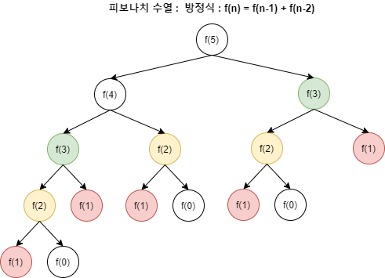
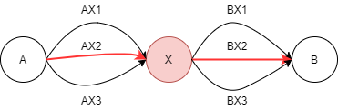

# 동적 계획법(Dynamic Programming)

### WHAT IS?

하나의 큰 문제를 여러 개의 작은 문제로 나누어서 그 결과를 저장하여 다시 큰 문제를 해결할 때 사용하는 컨셉! 수열의 점화식 느낌 유남생? aka '기억하며 풀기' 

### WHY USE?

사실 DP는 일반적인 재귀법과 매우 유사함. 하지만 그 효율성은 말도 못하게 더 높다.

일반적인 재귀법은 보통 O(n^2)의 시간 복잡도를 나타내는 반면 DP는 O(f(n))의 시간 복잡도를 보인다.



위 그림처럼 재귀법을 사용한다면 불필요하게 한번 구했던 값 (=함수 호출 횟수)을 한번 더 구해야함.

이때 한번 구한 `작은 문제의 결과` 를 저장했다가 `재사용` 하면 굉장히 효율적이게 되겠죵?

이것이 바로 DP의 핵심 개념입니다!

### WHAT CONDITIONS?

DP를 사용하기 위해서는 아래 2조건을 만족해야 합니다.

1. 겹치는 부분 문제 (Overlapping Subproblems)
    
    DP는 기본적으로 문제를 나누고 그 문제의 결과 값을 재활용해서 전체 답을 구한다. 그래서 **동일한 작은 문제들이 반복하여 나타나는 경우에 사용이 가능**하다.
    
    즉, DP는 부분 문제의 결과를 저장하여 재 계산하지 않을 수 있어야 하는데, 해당 **부분 문제가 반복적으로 나타나지 않는다면 재사용이 불가능하니 부분 문제가 중복되지 않는 경우에는 사용할 수 없다.**
    
2. 최적 부분 구조 (Optimal Substructure)
    
    **부분 문제의 최적 결과 값을 사용해 전체 문제의 최적 결과를 낼 수 있는 경우**를 의미한다. 
    만약, A - B까지의 가장 짧은 경로를 찾고자 하는 경우를 예시로 할 때, 중간에 X가 있을 때, A - X / X - B가 많은 경로 중 가장 짧은 경로라면 전체 최적 경로도 A - X - B가 정답이 된다.
    
    
    

### HOW USE?

아래 단계를 거쳐 문제를 해결할 수 있습니다.

**1) DP로 풀 수 있는 문제인지 확인**

**2) 문제의 변수 파악**

**3) 변수 간 관계식 만들기(점화식)**

**4) 메모하기(memoization or tabulation)**

**5) 기저 상태 파악하기**

**6) 구현하기**

### 1. **DP로 풀 수 있는 문제인지 확인**

현재 직면한 문제가 작은 문제들로 이루어진 하나의 함수로 표현될 수 있는지를 판단

보통 특정 데이터 내 최대화 / 최소화 계산을 하거나 특정 조건 내 데이터를 세야 한다거나 확률 등의 계산의 경우 DP로 풀 수 있는 경우가 많다.

### 2. 문제의 변수 파악

문제 내 변수의 개수를 알아내야 한다. ( = state를 결정한다.)

예를 들어, **피보나치 수열**에서는 n번째 숫자를 구하는 것이므로 n이 변수가 된다. 그 변수가 얼마이냐에 따라 결과값이 다르지만 그 결과를 재사용하고 있다.

### 3. 변수 간 관계식(점화식) 만들기

변수들에 의해 결과 값이 달라지지만 동일한 변수값인 경우 결과는 동일하므로 우리는 이를 관계식으로 만들어 낼 수 있고 그 관계식을 점화식이라고 한다!

예를 들어 피보나치 수열에서는 **f(n) = f(n-1) + f(n-2)** 

### 4. 메모하기

변수 간 관계식까지 정상적으로 생성되었다면 **변수의 값에 따른 결과를 저장**

보통 배열을 쓰며 변수의 개수에 따라 배열의 차원이 1~3차원 등 다양할 수 있다.

### 5. 기저 상태 파악하기

**가장 작은 문제의 상태를 알아야** 한다.
**피보나치 수열을 예시로 들면, f(0) = 0, f(1) = 1과 같은 방식**
해당 기저 문제에 대해 파악 후 미리 배열 등에 저장해두면 된다.

### 6. 구현하기

2가지 방식으로 구현 가능함.

1. **Bottom-Up (Tabulation 방식) - 반복문 사용**
    
    **아래에서 부터 계산을 수행 하고 누적시켜서 전체 큰 문제를 해결하는 방식**
    
    dp[0]부터 시작하여 반복문을 통해 점화식으로 결과를 내서 
    dp[n]까지 그 값을 전이시켜 재활용하는 방식
    
    메모하기 부분에서 Memoization이라고 했는데 Bottom-up일 때는 Tabulation이라고 부른다.
    
2. **Top-Down (Memoization 방식) - 재귀 사용**
    
    dp[0]의 기저 상태에서 출발하는 대신 dp[n]의 값을 찾기 위해 **위에서 부터 바로 호출을 시작**하여 dp[0]의 상태까지 내려간 다음 해당 **결과 값을 재귀를 통해 전이시켜 재활용하는 방식**
    

```java
packge com.test;

public class Fibonacci{
    // DP 를 사용 시 작은 문제의 결과값을 저장하는 배열
    // Top-down, Bottom-up 별개로 생성하였음(큰 의미는 없음)
    static int[] topDown_memo; 
    static int[] bottomup_table;
    public static void main(String[] args){
        int n = 30;
        topDown_memo = new int[n+1];
        bottomup_table = new int[n+1];
        
        long startTime = System.currentTimeMillis();
        System.out.println(naiveRecursion(n));
        long endTime = System.currentTimeMillis();
        System.out.println("일반 재귀 소요 시간 : " + (endTime - startTime));
        
        System.out.println();
        
        startTime = System.currentTimeMillis();
        System.out.println(topDown(n));
        endTime = System.currentTimeMillis();
        System.out.println("Top-Down DP 소요 시간 : " + (endTime - startTime));
        
        System.out.println();
        
        startTime = System.currentTimeMillis();
        System.out.println(bottomUp(n));
        endTime = System.currentTimeMillis();
        System.out.println("Bottom-Up DP 소요 시간 : " + (endTime - startTime));
    }
    
    // 단순 재귀를 통해 Fibonacci를 구하는 경우
    // 동일한 계산을 반복하여 비효율적으로 처리가 수행됨
    public static int naiveRecursion(int n){
        if(n <= 1){
            return n;
        }
        return naiveRecursion(n-1) + naiveRecursion(n-2);
    }
    
    // DP Top-Down을 사용해 Fibonacci를 구하는 경우
    public static int topDown(int n){
        // 기저 상태 도달 시, 0, 1로 초기화
        if(n < 2) return topDown_memo[n] = n;
        
        // 메모에 계산된 값이 있으면 바로 반환!
        if(topDown_memo[n] > 0) return topDown_memo[n];
        
        // 재귀를 사용하고 있음!
        topDown_memo[n] = topDown(n-1) + topDown(n-2);
        
        return topDown_memo[n];
    }
    
    // DP Bottom-Up을 사용해 Fibonacci를 구하는 경우
    public static int bottomUp(int n){
        // 기저 상태의 경우 사전에 미리 저장
        bottomup_table[0] = 0; bottomup_table[1] = 1;
        
        // 반복문을 사용하고 있음!
        for(int i=2; i<=n; i++){
            // Table을 채워나감!
            bottomup_table[i] = bottomup_table[i-1] + bottomup_table[i-2];
        }
        return bottomup_table[n];
    }
}

/*
결과
832040
일반 재귀 소요 시간 : 9

832040
Top-Down DP 소요 시간 : 0

832040
Bottom-Up DP 소요 시간 : 0
*/
```